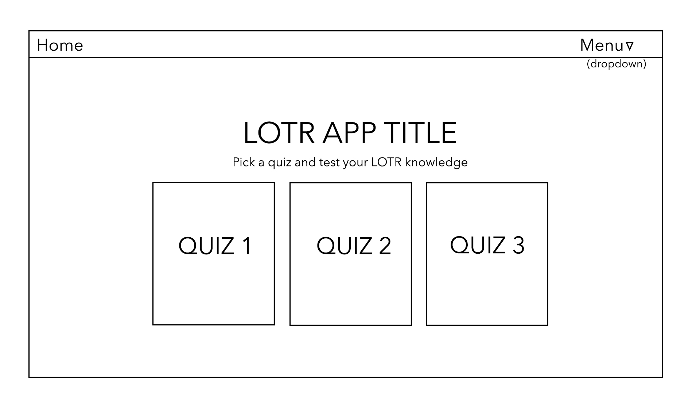
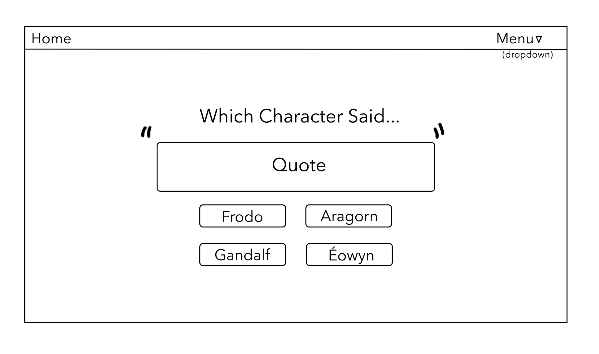
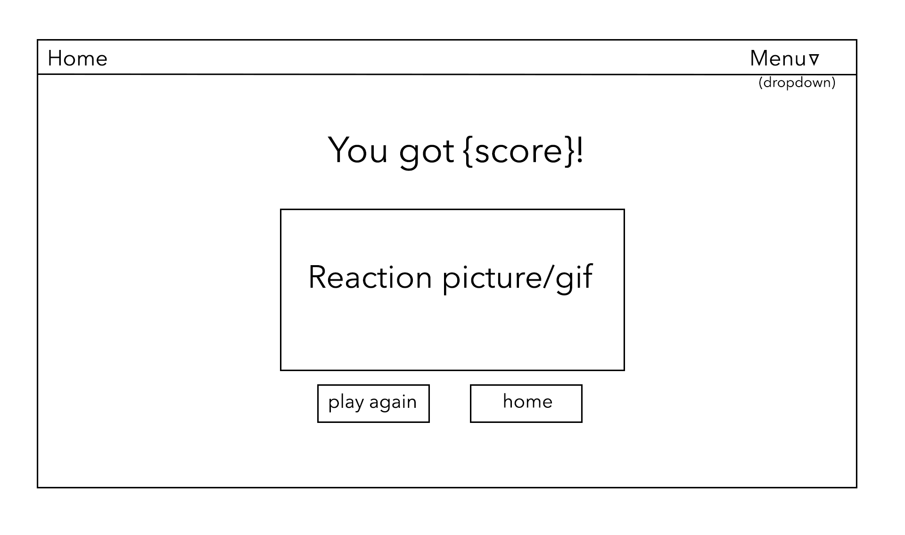

# Group Members
* Justine Solano: https://github.com/justinesolano
* Jonty Ward: https://github.com/jonty-ward

# Project Brief
* Consume a public API – this could be anything but it must make sense for your project.
* Have several components
* The app can have a router - with several "pages", this is up to you and if it makes sense for your project.
* Include wireframes - that you designed before building the app.
* Be deployed online and accessible to the public 

# Timeframe
* 2 Days

# Description
The Lord of the Rings Quiz App allows you to play two quizzes - the first a 'Guess Which Character Said' quotes quiz, and the second a 'Guess Which Movie This Quote Is From' quiz that only covers the LotR movie trilogy. There are 20 questions for each quiz with four answers and you score a point when you get a question right. The player gets a different LotR gif depending on their quiz score.

# Deployed version
https://lotrquiz-app.netlify.app

# Technologies used
## API
* https://the-one-api.dev/
## Frontend
* React
* Axios
* Bulma
* SASS
* React Router DOM
## Development tools
* VSCode
* Insomnia
* Yarn
* Git & GitHub
* Google Chrome development tools
* Adobe Photoshop 2021 (wireframes)
* Fontmeme.com (logo and titles)
* Icons8.com (LotR character icons)
* Netlify (deployment)

# Installation
Clone or download sei-project-two repo then run these in Terminal:
  * yarn to install yarn packages
  * yarn start to run localhost in browser

# Process

## Planning (day 1)
### Concept.
Justine and I wanted to do something fun so we decided to create a quiz app. We both decided on a Lord of the Rings themed quiz because we both love the trilogy. It was only a 2-day hackathon so we kept our scope tight and doable. We decided to do 3 quizzes as the API we used provided a handful of routes that were useful for different quizzes such as /character, /book, /quotes, /movies.

### Wireframes




We decided to do a quiz for ‘guess the character who said this quote’ and a ‘guess what movie this quote is from’ quiz. We also wanted to do a main character quiz where the question would select a random trilogy main character and the player would have to choose a quote that the character said during the three films.

### Frontend
After being signed off, we started on the first quiz. We used two endpoints here: /character, and /quote.

```
const [quotes, setQuotes] = useState(null)
  const [characters, setCharacters] = useState(null)
  const [movie, setMovie] = useState(null)

  useEffect(()=>{
    const getData = async () =>{
      try {
        const response = await axios.get('https://the-one-api.dev/v2/character', 
          {
            headers: {
              Authorization: `Bearer ${token}`,
            },
          })
        setCharacters(response.data.docs)
      } catch (err) {
        setErrors('This page is broken, try again later!')
      }
    }
    getData()
  }, [])

  useEffect(()=>{
    const getData = async () =>{
      try {
        const response = await axios.get('https://the-one-api.dev/v2/quote', 
          {
            headers: {
              Authorization: `Bearer ${token}`,
            },
          })
        // console.log(response)
        setQuotes(response.data.docs)
      } catch (err){
        setErrors('This page is broken, try again later!')
      }
    }
    getData()
  }, [])

```

There was a problem with the API that we realised soon after. The quote endpoint only included quotes from The Two Towers and Return of the King films and not from Fellowship. We then had to add a GET request from the specific film's endpoint quotes:
```
 useEffect(()=>{
    const getData = async () =>{
      try {
        const response = await axios.get('https://the-one-api.dev/v2/movie/5cd95395de30eff6ebccde5c/quote', 
          {
            headers: {
              Authorization: `Bearer ${token}`,
            },
          })
        setMovie(response.data.docs) 
      } catch (err){
        setErrors('This page is broken, try again later!')
      }    
    }
    getData()
  }, [])
```

We then merged the Fellowship quotes data by spreading spreadData = [...quotes, ...movie] into a let variable let spreadData = [] declared at the beginning then using the variable to generate a random quote from these endpoints using the Math.random() method:
```
 const randomQuote = Math.floor(Math.random() * spreadData.length)
  const randomCharacter1 = Math.floor(Math.random() * characters.length)
  const randomCharacter2 = Math.floor(Math.random() * characters.length)
  const randomCharacter3 = Math.floor(Math.random() * characters.length)
  const rightAnswerRandom = spreadData[randomQuote].character

  ```
We also decided to have a visible score counter that dynamically changed with every question answered so the player can keep track of their score.
```
 const handleChoice = (event)=>{
    event.target.id === 'choice1' ? setCounterRight(counterRight + 1) : setCounterWrong(counterWrong + 1)
    randomButtonsOrder()
  }

```
We also encountered another problem which was that the right answer would appear in the same button every time in the same position. We came up with a solution pretty quickly which was to generate a randomButtonsOrder function to randomize the orders of the button so the right answer would appear in a different position. We used the Math.random() method to do this too.


```
function buttonNumberGenerator() {
    return Math.floor(Math.random() * 4)
  }

  const buttonsOrder = buttonNumberGenerator()

  ```
We then wrote a function declaring the different orders of the four buttons with the right answer placed in a different button each time. There were four different orders laid out like so:
```
const randomButtonsOrder = () => {
    if (buttonsOrder === 0){
      return (
        <div className="answers">
          <div className="top-two">
            <div>
              <button onClick={handleChoice} className={`${characters._id} button is-dark is-large`} id="choice1">
                {filteredCharacters[0].name}
              </button>
            </div>
            <div>
              <button onClick={handleChoice} className={`${characters._id} button is-dark is-large`} id="choice2">
                {characters[randomCharacter1].name}
              </button>
            </div>
          </div>
          <div className="bottom-two">
            <div>
              <button onClick={handleChoice} className={`${characters._id} button is-dark is-large`} id="choice3">
                {characters[randomCharacter2].name}
              </button>
            </div>
            <div>
              <button onClick={handleChoice}  className={`${characters._id} button is-dark is-large`} id="choice4">
                {characters[randomCharacter3].name}
              </button>
            </div>
          </div>
        </div>
      )
    }
```
  
which was then called in the JSX within the choices div.

```
<div className="choices">
  {randomButtonsOrder()}
</div>
```
We did the same for Quiz 2 but the choice buttons did not need to be randomized because there were only 3 answers that were available for every question:

```
 const movieName = () =>{
    if (rightAnswerRandom === '5cd95395de30eff6ebccde5b'){
      return 'The Two Towers'
    } else if (rightAnswerRandom === '5cd95395de30eff6ebccde5c'){
      return 'The Fellowship of the Ring'
    } else if (rightAnswerRandom === '5cd95395de30eff6ebccde5d'){
      return 'The Return of the King'
    } 
  }
  movieName()

```
We did not have time for a third quiz because we needed to begin styling during the second day.
The Quiz1End/Quiz2End components are the results page. It shows the player's final quiz score and uses conditional rendering to show a gif based on this score. There are four different gifs for each score range: 0-5, 6-10, 11-15 & 16-20. As an extra page, we added a link in the Menu to the API we used.

### Quiz 2 (night 1 & day 2)

After setting up the first quiz together, we decided to begin the styling as soon as possible because we were tight for time. We decided that I would continue setting up Quiz2 and Justine would begin the styling. We decided to use Bulma for this project.
For the second quiz, I followed a similar logic to quiz one. The design of the quiz was more straightforward than the initial quiz because the quiz had only three possible answers- the three films in the trilogy. This eliminated the need to have the buttons appearing in a different order. 
When testing the quiz app, I came across a fairly major bug. The quiz questions only related to two of the movies. After making some requests in Insomnia, I realised that there was a problem with the api. The /quote route only contained information from two of the movies. I decided the way forward was to create an array and spread in the data from the /quotes endpoint and the specific movie endpoint. Once the array was created it was a matter of simply choosing a random quote. 

```
spreadData = [...quotes, ...movie]
```

As an extra feature I also decided it would be interesting to have which character said the quote. The data from the /quote route only had the character ID, and not the populated information about the character, so I needed to figure out a way to combine multiple routes to achieve this. This was simple to achieve, and involved pulling down the /character route which contained all information about each character. I then performed a filter through all the characters using the ID that was part of the random quote used for the question, returning the name of the character whose ID matched the id for the quote. 

```
const filteredCharacters = characters.filter(character => {
  return character._id === spreadData[randomQuote].character
})
```

On day 2 we focused on applying the styling to quiz 2, and making adjustments to styling on the rest of the site. We came across a problem testing the site. The requests were limited to 100 every 10 minutes. With all the routes needed for the quizzes, we ended up having to wait while we tested our styling for the quiz end screen. To help overcome this, we created several accounts, and I created a small function to alternate the access token we were using to speed along the testing and development. This has been removed from the codebase for deployment as we moved the access token into a .env file. 

With the styling on day 2 We had a lot of trouble with flexbox on the quiz pages, specifically with the Right/Wrong counter beside the quiz questions. When I opened the page on his PC which was a smaller size than mine, the placement of several divs and the quotes box were severely out of place. We had to find a way to make the page render the elements in sensible positions regardless of screen size so that they wouldn't be hiding behind other elements or be melded at the top of the page with the navbar. Justine had to use a lot of time figuring out margins and flexboxing the counter. It was styled so that when the screen reached a certain width, the counters would change positions from the right to the left of the screen as space would run out on the right when the browser was resized smaller. This was very fiddly, and as a result we have only managed to make the quiz playable on differing laptop and desktop sizes. 

## Final project walkthrough